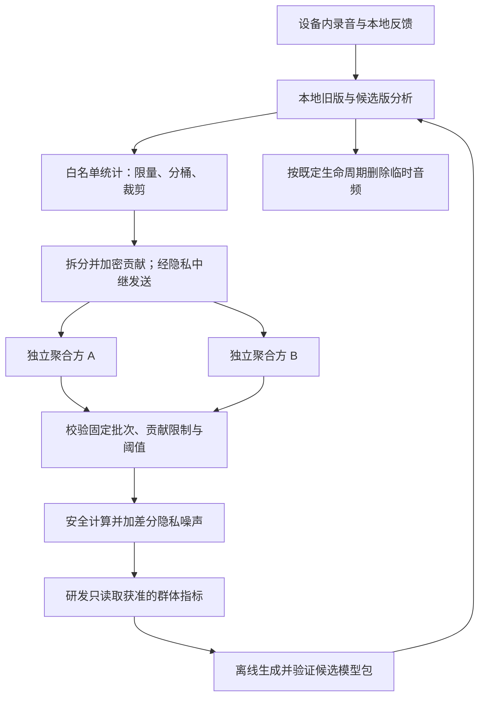

# Pitchee 不上传音频的模型改进计划

日期：2026-09-30。状态：总体设计；P0/P1 的部分内容已实现为 [本地诊断原型](/Users/dannyfeng/Documents/Pitchee/Docs/Local-Diagnostics-Prototype.md) 和 [本地评分对照实验](/Users/dannyfeng/Documents/Pitchee/Docs/Local-Score-Study.md)。后者比较现有最终综合分与封顶、提升之前的基础分，引入分数显示前的自评。新增 [研究协议与合成效用验证](/Users/dannyfeng/Documents/Pitchee/Docs/Score-Study-Research-Protocol.md)，提供 26 维有界贡献和预算计算的离线参考。尚未实现在线采集、聚合服务、新声学模型或联邦训练，也尚未取得正式模型效果证据。

适用范围：Pitchee iOS、Android 与所集成的 PitcheeCore；包括 VAD、F0、VFP、自然度、综合评分及运行性能。本文依据当前工作区源码，其中包含尚未提交的修改；不代表已发布版本行为。

## 1. 建议采用的模式

采用“端侧诊断 → 隐私聚合 → 提出候选改进 → 端侧对照评估 → 验证后发布”的闭环。原始录音和敏感声音特征留在设备上，研发团队获得限定用途的群体统计与候选版本效果差异。

第一阶段优先优化评分规则、置信度提示、录音质量门槛和运行性能；有了可靠标签、足够参与量和经过验证的隐私基础设施，再尝试小型评分头的联邦训练。不要一开始就建设完整声学模型的联邦训练系统。

| 层级 | 端侧工作 | 团队得到什么 | 能实现的改进 |
| --- | --- | --- | --- |
| A. 本地个人适配 | 个人基线、目标设置、重复练习比较 | 无上传 | 个人趋势、目标区间、展示习惯；默认不修改通用声学模型 |
| B. 群体诊断 | 从分析结果提取少量分桶计数 | 多人合并且经过差分隐私处理的统计 | 定位失败、噪声、设备差异、评分封顶和性能问题 |
| C. 端侧候选评估 | 同一录音运行旧版和候选版，对比独立反馈或标签 | 配对误差差值、胜负平计数、失败率差异 | 比较规则、模型、阈值是否确实改善 |
| D. 联邦训练，后续选项 | 用本地特征和独立标签训练小型头 | 安全聚合并加噪的群体更新 | 训练校准层或小型评分头；不是靠日志直接重训整个模型 |

“不上传音频”不等于“不上传敏感信息”。声音特征、精确曲线、单条评分及模型更新都需要独立审视；安全聚合、差分隐私和数据最小化解决的是不同问题。

## 2. 设计前的代码基线与约束

1. **现有端侧结果已经覆盖基础诊断所需的大部分指标。** `PitcheeAnalysisResult` 有音频时长、VAD、F0、VFP、自然度和评分规则，并含逐窗时间轴。应从这些结果生成新的最小统计对象，不能直接把结果对象作为遥测协议。
2. **iOS 原始录音只用于本地当前会话。** `AnalysisViewModel` 将 WAV 写入临时目录；评分实验在最终分析前等待可选自评，未保留的录音在分析退出时尝试删除。当前工作区同期新增 A/B 练习回听，成功录音可能暂存到练习结束或被替换。候选默认仍只处理本次新录音，不扫描历史；实验等待与主产品回听都必须说明保留边界，不能承诺所有录音分析后立即删除。会话期限、清理失败、崩溃遗留和取消路径仍需专门验证。
3. **本地完整分析结果仍属敏感资料。** iOS 的 `RecordingAssessment.resultPayload` 保留完整结果、逐窗分数以及本地 UUID 和时间；本地存储合理，不意味着可上传。
4. **Android 需要覆盖系统备份路径。** `HistoryStore` 把录音和完整 JSON 复制到 `filesDir`；初始检查发现 Manifest 启用备份，两个备份配置将 `file` 与 `sharedpref` 整体纳入云备份范围。本轮已关闭备份资格并排除各存储域的云备份与设备迁移，历史仍保留原路径。源码配置不能证明任何设备曾上传，也不能追溯删除旧备份；实际备份/恢复仍需设备验证。
5. **特征不是匿名摘要。** 当前嵌入式 Core 产生 192 维 ECAPA embedding，自然度特征包含 embedding 的均值和标准差，共 384 维。它们是声音表征，不能因为经过求均值、归一化或降维就视为可公开数据。
6. **男性向评分是 Core 的显式方向 profile。** 当前 profile 使用 VFP 和 F0 的方向性公式，并非独立训练、独立验证过的男性向模型。需要分开评估，不能推断女性向模型的改进必然同样有利于男性向。
7. **不能只用月份识别模型。** iOS 实际编译 `Dependencies/PitcheeCore`，本次其提交为 `f0a4347`、schema 为 2；旁边的 `Pitchee Core` 工作区实现并不相同。模型清单已提供各 ONNX 文件哈希，但 `modelVersion` 仍是月份。研究必须绑定完整模型包哈希、Core 提交、预处理版本和应用评分规则版本。
8. **当前接入以推理为主。** 没有从本次检查的入口看到现成的端侧训练链路。联邦训练需要新增可训练模型、梯度计算、聚合、验证与发布设施，不能当成给现有 ONNX 推理加一个上传按钮。

以上为源码检查结果，未做运行时抓包、设备备份恢复或密码协议审计。

## 3. 先定义“改进”，再决定要什么数据

| 改进目标 | 能证明改善的指标 | 不能替代它的指标 |
| --- | --- | --- |
| 更准确地识别语音 | 有独立语音边界标签时的漏检率、误检率 | 单看 VAD 检出的语音比例 |
| 更准确地估计 F0 | 有参考 F0 时的 cents 误差、倍频/半频错误率、浊音判断误差 | 曲线更平滑、平均 F0 更高 |
| 更符合声音感知 | 独立听评或目标反馈上的排序一致性、评分误差 | VFP 自己给自己做标签 |
| 更可靠的自然度反馈 | 明确定义“自然度”的独立评价、标注者一致性、候选版本误差 | 当前自然度模型的分数，或把自然度当作发声健康程度 |
| 更有用的综合评分 | 与用户目标、独立听评的一致性；阈值附近稳定性 | 总体平均分上涨、用户总选高分版本 |
| 更好的运行体验 | 分析成功率、阶段耗时分布、资源预算、不同设备上的退化 | 用户满意度代替数值准确性 |

VFP 可以被用作一个模型输出，但不能直接解释为某个人的性别身份，也不能未经校准就称为真实世界中的某种精确概率。训练方向是用户选择的目标，不是身份标签。综合分、自然度与音高都不能直接推导发声是否健康。

## 4. 数据清单：本地保留什么，群体贡献什么

下表的“贡献形式”均指端侧先限量、分桶或归一化，再进入安全聚合的数值向量；不表示服务器接收逐条明文记录。各项按研究目的选择，不把整张表拼成每人的多维画像。

| 数据类别 | 本地可用或需新增的数据 | 建议的贡献形式 | 用途与优先级 |
| --- | --- | --- | --- |
| 版本与计算配置 | 模型包清单哈希、Core 版本、评分版本、预处理版本、schema、运行后端 | 公共研究配置 ID；后端使用有限枚举 | 所有比较必需。配置为公开版本，不包含设备标识 |
| 分母与状态 | 分析尝试、成功、失败、取消；反馈邀请、完成、跳过 | 有界计数或每安装的比例；分别保留有效分母 | P0，避免只观察成功样本和愿意反馈的人 |
| 输入形态 | 时长、有效语音时长、采样率、声道、麦克风路由 | 时长如 `<5/5–10/10–20/20–60/>60 秒`；语音比例分桶；路由仅内置/有线/蓝牙/其他 | P0，定位短音频、重采样和录音设备问题，不上传蓝牙名称或地址 |
| 录音质量 | 削波比例、底噪估计、语音/背景电平差、过低电平 | 无/轻/重削波、质量等级、无法估计 | P0，已有 iOS 音量统计可复用；削波需新增。背景估计依赖 VAD，应称为质量代理，不冒充精确 SNR |
| VAD | 语音比例、片段数、被裁剪或过滤的数量、无语音失败 | 低维比例直方图、片段数档位、错误枚举 | P0，诊断漏检嫌疑；没有标注时不能声称测得真实漏检率 |
| F0 | 均值/分位数、无效帧比例、置信度、突跳或倍频嫌疑 | 20–25 Hz 的粗档位、有效率档位、嫌疑计数 | P1，只在对应研究启用。离线结果未提供的置信度需显式增加本地诊断，不从分数臆造 |
| 模型与评分行为 | 整段 VFP/自然度、窗间波动、命中规则、封顶与提升幅度 | 10 分桶、规则计数、受限比例、波动等级 | P1，定位模型/规则问题。不上传逐窗结果、完整曲线或每条录音的精确三指标组合 |
| 结构化反馈 | 目标符合度、自然感、结果是否有帮助、问题类型、无法判断 | 有限等级或类别计数；标签来源分开记录 | P1，提供弱监督与产品反馈，不收自由文本 |
| 候选版比较 | 同一输入上的旧/新损失、耗时、失败；盲听或独立标签 | 有界的配对损失差、胜负平计数、差值直方图、必要的二阶矩 | P1，直接回答是否改善。只收旧/新分数差不能证明准确性 |
| 覆盖与适用性 | 练习语言、朗读/自然说话、目标方向、设备性能等级 | 自选大类，另有“不提供”；每项研究最多选择少量分层 | P1，可选并单独说明；不自动推断身份、口音、国籍或病史 |
| 运行性能 | 各阶段耗时、失败代码、峰值内存或热状态档位、后端回退 | 固定耗时桶、有界计数；OS 主版本和设备性能大类 | P0，新增阶段计时。框架请求 Core ML 不代表实际所有算子都使用它，未知时标未知 |
| 长期效果 | 本地多次练习的变化、同一目标下的稳定性 | 后续研究可贡献每安装的变化区间或斜率桶 | P2，个人时间序列和历史 UUID 留本机。无对照时不能把变化归因于模型或训练方法 |

缺失必须分成 `not_available`、`not_provided`、`not_applicable` 等受控值；不能拿 0 代替没有可靠 F0、没有标签或未采集。

### 最小上线集合

首期仅启用版本配置、尝试/成功/失败分母、输入时长/语音比例、质量等级、有限失败代码、耗时分布。它先验证基础设施和实际问题分布。

第二步只选择一个研究问题加入评分规则计数、一个独立反馈问题和一个候选版本。例如：“自然度封顶是否在高噪声场景中过度降低了符合用户目标的声音评分？”不要同时开启所有 F0、音色、目标、语言和设备交叉维度。

### 禁止进入改进上传接口的数据

- 原始或压缩音频、音频片段、PCM、可播放或可重建声音的其他编码。
- ECAPA/speaker embedding、384 维自然度特征、Mel/STFT/MFCC、模型中间激活；量化、哈希或去掉姓名不是充分保护。
- 逐帧 F0、频谱、音量/评分曲线、VAD 精确边界、带时间索引的窗口数组、完整分析 JSON。
- 音频转写、自由文本、原始错误字符串、日志附件、录音路径/文件名/哈希、绝对录音时间、地理位置。
- 账户 ID、广告 ID、永久遥测 ID、蓝牙标识、精确设备指纹；不采集出生性别、跨性别身份、药物/激素或手术经历。
- 单条样本梯度或单设备可读模型更新。后续联邦训练只允许进入独立、经审查的安全聚合协议。

研发不保留逐次录音明细表；服务端日志和错误报告同样受此边界约束。

## 5. 标签从哪里来

| 来源 | 获取方式 | 可以支持的结论 | 限制 |
| --- | --- | --- | --- |
| 用户结构化自评 | 听自己的声音后，对目标符合度或自然感选择等级；尽量在展示模型分数前提问 | 个体目标是否匹配、明显异常、产品有用性 | 主观弱标签，不等于外部听众感知或客观声学真值 |
| 本地成对比较 | 同一练习内比较两段自己的声音，随机播放顺序，允许持平/无法判断；模型在设备上计算对该排序的预测 | 模型排序与人的偏好是否一致 | 应分开问目标符合度和自然感；避免只问喜欢哪个高分界面 |
| 训练师或研究听评 | 标注者在参与者设备或受控本地研究设备上听评；评分和误差在本地计算 | 更规范的感知标签、标注者一致性 | 音频被现场标注者听到必须事先说明；远程传音不属于本方案 |
| 有授权的公共/研究数据 | 使用许可覆盖目标用途的数据，在独立研发数据环境建立基准 | 离线训练与回归测试、部分 F0/VAD 真值 | 不是产品用户数据上传渠道；说话人隔离、去重、许可及分布适用性需验证 |
| 合成信号和可控扰动 | 已知 F0 的测试信号；本机加噪、增益、重采样；具有合法来源的样本 | 数值正确性、预处理、鲁棒性与不变性 | 不能单独证明真实声音感知、自然度或目标人群上的效果 |

对同一段声音比较新旧“评分”时，声音本身没变。正确做法是先得到独立评价，再比较旧/新模型对评价的误差；不是让用户在两个分数中选更喜欢的数字。

反馈通过本地随机 ID 关联本地录音与分析，ID 不出设备。避免仅在低分或异常后询问：采用随机抽样并记录邀请、回应、跳过的群体分母。每安装贡献次数设上限，防止少数高频练习者支配结果。

## 6. 数据流与信任边界



### 威胁模型

保护对象包括声音内容、说话人表征、个人练习轨迹、训练目标，以及参与某项研究的关联信息。需要防御好奇的分析人员、单个聚合服务泄露、网络元数据关联、差分查询、恶意研究配置、伪造贡献与模型更新泄露。

推荐采用成熟的多方私有聚合协议：统计被拆成密文份额，至少两个在管理和密钥上独立、假设不串通的聚合方协作。只获得其中一份不能读出单人的统计。协议、加噪和查询授权需经过独立审查，不自行设计密码算法。

同一管理主体控制的两台服务器不能自动提供这里所需的独立性。选择运营方、约束其串通风险、安排密钥和审计隔离，属于方案成本；不能仅凭部署了两个服务就宣称实现该信任边界。

该设计不承诺抵御设备已被控制、两个聚合方串通或用户主动公开导出文件等所有情形。中继降低来源关联，但不能保证消除全球流量分析；差分隐私对统计输出的保护也不自动覆盖 IP、参与状态、同意记录或基础模型既有训练数据。

### 三种机制各自负责什么

| 机制 | 解决的问题 | 不解决的问题 |
| --- | --- | --- |
| 数据最小化、分桶、去时间序列 | 降低收集内容和精度 | 不能单独保证匿名，也不是差分隐私 |
| 安全聚合 | 防止研发或单个聚合方读取单安装贡献 | 精确群体和、少数群体或重复查询仍可能泄露 |
| 差分隐私与预算记账 | 限制一个受保护单位的贡献对可见结果的影响 | 不负责传输安全、数据授权、终端安全，也不等于零泄露 |

## 7. 聚合、差分隐私与发送规则

1. **先做本地限制。** 每研究每安装每周最多抽样 5 次分析，各项指标在设备内先聚合。每安装每研究每周最多提交一个贡献向量；反馈抽样上限可更低。研究之间统一计入隐私预算。
2. **预先固定向量。** 用研究清单限定指标名称、维度、边界、分母、分桶和裁剪范数。示例研究最多 32 维，不足以覆盖全表时应缩小研究问题，不能无限扩展。
3. **定义保护单位。** 无账户的首期正式保证按“一个安装实例在试点中的全部贡献”定义，而非每帧或每次录音。多设备、卸载重装会破坏“一个人等于一个安装”的假设，不得宣传已经实现严格的人级保护。
4. **限制整个向量的影响。** 固定缩放后对完整向量执行范数裁剪，不能每个字段各自加噪却忽略联合敏感度。示例使用加/删一个安装的邻接关系；更换为替换邻接时须重算敏感度。
5. **安全聚合后只发布加噪结果。** 群体原始和也不对产品分析人员开放；噪声由聚合协议内可信边界产生，使单方不能取消。采用已审查的分布式噪声方案或相应受保护计算，不能先让研发看精确统计、再在报表上加噪。
6. **小群体不出结果。** 示例最低门槛为 100 个有效、去重的安装贡献，固定最长 7 天批次。人数不足则过期丢弃，不降低阈值、不退回逐条上传。100 只是试点安全门槛，不代表统计功效或充分匿名。
7. **连“是否发布”也要审视。** 研究清单和批次提前公开固定。若发布/抑制取决于敏感人数，应纳入差分隐私选择机制或相应证明；不得通过精确人数、稀有分组有无结果等旁路泄露。对外样本量同样使用批准的保护机制。
8. **阻止差分查询。** 不允许分析人员任意选择成员、细分到极小群体、重复查询并平均噪声，或对相近人群反复相减。同一结果缓存复用；新的自适应查询消耗新预算。
9. **分离身份与内容。** 通过独立中继发送固定大小或填充后的密文，使用随机延迟、公共批次 ID、一次性贡献凭证；不带账户、录音 UUID 或精确本地时间。聚合端不记录来源 IP、请求体或可跨研究串联的 ID。
10. **明确凭证的能力边界。** 需要短期、限定研究和批次的不可链接凭证，分别解决资格、重复贡献与重放。令牌发行方也需最小化日志。普通随机 UUID 并不能保证安装去重或抵御伪造；不能为计人数偷偷引入永久指纹。若资格、预算和防伪机制无法验证，先不开展在线收集。
11. **失败时停止发送。** 聚合方不可用、预算不足、清单过期或协议校验失败时在本地丢弃。不能降级为普通 POST 上传摘要；基础声音分析继续正常工作。

指标还必须固定统计口径：默认每安装先计算一次有界指标，再在安装之间平均，回答“典型参与安装的体验”。这不同于按全部录音条数加权的总体失败率。若研究需要后者，需使用有界次数与分母的另一种正式设计，单独核算敏感度并说明抽样/裁剪偏差。不能把贡献计数当成独立人数，也不能把加噪后的极小或负分母直接用于计算比率；应按预注册规则抑制不可靠结果。

### 试点参数草案

| 项目 | 初始建议 | 上线前必须验证 |
| --- | --- | --- |
| 研究周期 | 最长 90 天，固定每周批次 | 招募能力、响应偏差与功效 |
| 每安装贡献 | 每研究每周最多 1 个向量，由最多 5 次随机抽样分析得到 | 跨研究总贡献与裁剪一致性 |
| 批次门槛 | 至少 100 个有效安装；不足 7 天后丢弃 | 真实有效参与量与去重，不能按报告数计人 |
| 隐私预算 | 试点每安装累计 ε ≤ 2、δ ≤ 10⁻⁷，作为待验证的上限草案 | 根据机制、采样、维度、敏感度和会计器推导；不是预先证明的安全常数 |
| 预算耗尽 | 停止贡献，不因重启、升级、换周或 90 天结束自动重置 | 新研究须累加以往损失，不能用重新同意抹去既有隐私损失 |
| 分层 | 预注册少量维度，一般一次只看一个主要分层 | 稀疏度、DP 选择开销与多重比较 |
| 性能 | 候选实验有耗时、热状态和电量停止条件 | 在目标设备实测；额外执行不能妨碍主流程 |

上述数值是工程讨论起点。若模拟表明在这些约束下没有足够效用，应减少指标、扩大自愿参与量或回到离线研究，不能直接放宽隐私承诺。

后续离线验证已对一个 26 维评分研究执行合成模拟：在累计 ε ≤ 2、δ = 10⁻⁷ 和保守统计规则下，100 个有效配对安装不足以支持所设效果结论；最多 13 次发布的噪声与多次比较成本明显高于一次主要发布。首轮正式研究建议收敛为一次主要结果发布，具体条件和适用边界见 [研究协议](/Users/dannyfeng/Documents/Pitchee/Docs/Score-Study-Research-Protocol.md)。这不是对任意模型、分布或实际招募量的通用结论。

若未来要声称人级差分隐私，需要另行设计跨安装贡献上限与可信的计账方案，并说明其身份管理成本。在此之前，文案和报告统一使用“安装实例级保护”。

## 8. 同意、保存、撤回与备份

### 用户控制

基础功能离线可用，所有改进参与开关默认关闭，不以参加研究作为使用分析功能的条件。

| 开关 | 内容 | 是否改变录音保留 |
| --- | --- | --- |
| 帮助改进稳定性 | 受保护的失败、质量和性能统计 | 不延长 |
| 参与模型效果评估 | 当前研究需要的评分摘要、结构化反馈、候选模型本地执行 | 默认不延长；需要等待自评或本地回听时单独说明临时保留与清理。本地原型前台通常等待最多 30 秒再分析，系统暂停可能延迟处理 |
| 参与本机模型训练 | 后续才引入，单独说明计算开销及聚合更新 | 默认只利用当前会话；任何研究缓存需要另行明确选择 |

用户可查看当前研究的目的、数据种类、保留期及最近的贡献类别。这里展示自己设备上的记录，不建立服务端个人贡献历史。训练方向、语言等额外维度采用独立自愿选择，拒绝不影响参与基础诊断。

建议文案：

> 你可以选择帮助改进 Pitchee。录音和声音特征保留在这台设备上；设备只发送经过保护的少量统计，研究团队查看多人合并后的结果。参与不是使用条件，可以随时关闭。已合并的统计和已发布模型无法再按个人撤回。

此文案必须在对应架构与备份排除完成后使用。详情页说明独立聚合、统计保护的范围与局限；避免使用“完全匿名”“绝不可能识别”“不收集任何数据”等绝对表达。

### 生命周期

| 数据 | 保存位置与建议期限 | 删除或撤回方式 |
| --- | --- | --- |
| 临时录音、临时特征 | 本机；遵循当前录音生命周期，候选执行结束即清理 | 正常、异常、取消、崩溃恢复路径均覆盖；不建立默认研究音频库 |
| 用户选择保留的录音与完整报告 | 本机产品存储，不作为遥测队列；受设备加密和备份排除保护 | 用户主动删除。删除文件不等于保证闪存所有历史字节物理不可恢复 |
| 当次研究反馈关联 | 本机短期；计算完本次贡献后去掉录音关联；需要回听的临时会话最长建议 5 分钟 | 退出会话或超时删除，不为研究默默延长现有历史保留 |
| 待发送统计与密文份额 | 本机加密队列，最多 7 天；排除备份 | 关闭参与立即清理，不追溯上传开启前的历史 |
| 未封存批次的密文份额 | 聚合方最长 7 天；完成后 24 小时内清除 | 每份可使用一次性随机撤销凭据；封存前经中继撤销，确认成功后移除并重算参与门槛 |
| 传输日志 | 默认不记录 IP、请求体、精确设备信息；安全排障最小元数据最长 24 小时 | 与研究统计隔离，禁用身份关联与第三方分析 SDK |
| 已批准的加噪群体统计 | 研发数据集默认 180 天 | 到期删除；延长须明确新的必要性，不保留回查个人的映射 |
| 研究清单、代码版本、DP 会计、模型卡 | 可以长期保留，内容不得含个人数据 | 作为可复现和审计记录；不是保存原始贡献的理由 |

撤回分三种状态：未发送则立即删除；已发送但未封存时尝试凭匿名撤销凭据删除，离线或竞态下必须显示尚未确认；已经封存并形成聚合结果后，无法准确剥离某个人的贡献。联邦训练后的模型也不能承诺即时逐人“遗忘”。如果业务必须具备这种撤回能力，需要另行设计可追踪的训练批次和可重训策略，并重新权衡隐私成本。

### “不上传音频”的完整边界

- iOS：临时 WAV 之外，还要检查 SwiftData 数据库及 WAL/SHM、导出缓存、系统诊断、崩溃附件与应用备份。保留的敏感本地数据配置适当的文件保护，并验证锁屏行为。
- Android：排除 `filesDir` 中历史音频/JSON、偏好及研究缓存的云备份和自动设备迁移；可迁入 `noBackupFilesDir` 并正确迁移旧路径，但仍须验证支持系统版本的实际行为。不能只给 ONNX 模型目录设置 no-backup。
- 不让第三方遥测或错误 SDK 读取录音、内存音频缓冲、完整结果或用户文件名；错误上报只允许有限错误代码。
- 用户明确点击系统分享或保存到其他服务时，属于用户主动导出，应在产品中单独说明；不把它混入“改进计划”。
- 网络模块只接受隐私贡献对象，不能接收任意文件、字节附件或完整分析结果。下载模型和 Android 更新检查也不得附带历史或研究身份。

## 9. 收到统计后，具体怎样改模型

### 9.1 先改善规则、可靠性与计算性能

通过质量等级与错误率，确定需要解决的问题，例如噪声下的失败、短语音无结果、某种运行后端退化。粗分桶可帮助选择问题，但一般不足以在服务端任意拟合多变量模型。

对权重、封顶、最短有效语音或置信度策略，预注册少量候选配置，将候选计算放回端侧。设备拥有完整输入与局部标签，能计算每个候选的损失；服务端只比较聚合损失。这样不必收集每条录音的精确三指标与标签联表。

具体实验示例：

1. 假设：部分低自然度评分主要由录音质量影响，现有封顶导致目标符合度评价失真。
2. 基线：当前完整模型和规则包；候选：一个经过离线验证的质量门控或新规则配置。它的精确参数在实验前固定。
3. 本机：同一段录音获得质量等级、独立目标反馈及两版输出，计算两版相对反馈的配对损失。
4. 贡献：每安装归一化的损失差、有效反馈比例、候选失败率差；仅对预先规定的质量大类进行受保护比较。
5. 判定：独立评价上的损失降低，且失败率、关键分层和性能满足门槛；“候选得分更高”不算成功。
6. 发布：保留评分版本、解释变化与回滚路径。旧记录保存原始版本，重新解释的分数应标明版本，不能把模型换版造成的分数跃升显示成用户练习进步。

### 9.2 用端侧评估选择新的声学模型

在有授权的数据上训练或选取候选，先离线验证，再将签名模型包分发给自愿参与者。默认旧版结果用于正常界面，候选在资源允许时做影子评估；也可按预注册设计做随机对照。

iOS 需在当前临时 WAV 删除前运行候选；超时或系统热状态不允许时跳过，并计入适用样本分母。不能为了方便下次评估默默保留音频。Android 即使有本地历史，默认也仅评估参与后产生、属于本次研究范围的内容。

候选清单应固定模型哈希、Core 和预处理版本、任务、允许的输出、资源上限和隐私预算。下载通道校验签名与哈希；模型执行与网络隔离，限制算子和资源。签名只证明发布者，不证明模型行为安全：还要审查输出通路，并禁止向单个目标用户下发不同的特制模型或任意查询脚本。

这条路线能评估本地未上传的音频，却不能让研发远程听到或复现每个真实失败样本。无法定位的个例应通过授权研究、现场标注或可控复现补足，不能临时要求上报中间特征来绕开承诺。

### 9.3 后续联邦训练先限制在小型头

当问题需要从真实用户场景学习新映射、独立标签足够、端侧评估有效且参与规模足够时，才进入此阶段。

- 冻结大部分声学编码器，在设备内产生特征；只训练小型校准层、目标方向评分头或自然度头。训练方向须有独立任务定义，不能将 `100 - VFP` 自动当作已验证标签。
- 独立标签与局部特征只在本地结合。没有标签时，联邦训练不会凭空得到正确答案；自监督适配也需防止目标偏移和退化。
- 每个安装先合并本地更新再裁剪；将有界更新送入安全聚合，并在任何可见发布之前施加正式记账的差分隐私。不能让服务端读到每设备梯度。
- 冻结编码器并不自动使梯度安全。小型线性头的单样本梯度也可能泄露输入特征；更新需要单独的敏感度分析与攻击验证。
- 若只有一个头发生变化，仍要评估整体输出、分层效果和长期稳定性；精度、隐私和计算开销共同决定是否接受。
- 协议需要考虑伪造标签、恶意更新、Sybil 与后门。使用资格控制、有界贡献验证、隔离验证集、更新幅度限制和分阶段部署。安全聚合遮蔽单用户更新，许多依赖逐用户梯度检查的鲁棒方法不能直接套用。
- 每轮模型变化和发布指标统一计入隐私会计。已训练模型及其中间检查点是否可见，也属于发布面，不能只给最后一个指标加噪。

联邦训练的实施还需要可训练模型格式、移动端训练运行时、检查点和回滚机制；现有推理库不保证提供这些能力。若成本不合理，维持“授权数据训练＋用户设备评估”仍是一套完整的改进机制。

## 10. 评估与发布门槛

| 检查面 | 必须回答的问题 | 建议门槛或做法 |
| --- | --- | --- |
| 标签有效性 | 所谓改善依据什么真值？ | 标注定义、来源、缺失率、标注者一致性写入研究说明；不同来源不混成同一种标签 |
| 声学准确性 | VAD/F0 是否改善？ | 有真值的保留集上评估，F0 在参考浊音帧计算 `1200 × abs(log2(预测F0 / 参考F0))`，另报漏检和倍频错误 |
| 感知与目标 | 听评/目标排序是否改善？ | 预注册配对误差或排序一致性。只有概率标签语义成立时才使用校准误差或 Brier 等指标 |
| 可靠性 | 候选是否增加失败？ | 纳入所有随机分配的尝试；不能只比较两版都成功的录音。单独报告缺失、取消、热状态跳过 |
| 统计结论 | 样本量是否支持发布？ | 先确定最小有意义改善、非劣界限和样本量；区间同时考虑安装内相关、DP 噪声和多重比较 |
| 覆盖 | 哪些已验证人群/场景有退化？ | 对获准的大类分别检查；女性向、男性向和未确定目标分别说明适用性，不把整体提升当作每类提升 |
| 性能 | 额外成本是否可接受？ | 目标设备上的耗时分位数、内存、热状态；预注册预算后再上线，不在结果出来后移动门槛 |
| 隐私 | 能否绕过边界或关联个人？ | 包结构与链路验证、备份恢复检查、日志检查、预算组合、重放/小群体/差分查询攻击测试 |
| 模型安全 | 更新会否泄露或被投毒？ | 联邦阶段增加成员推断、梯度/特征重建及后门评估；攻击未成功不是形式隐私证明 |

必须预先锁定验证集和评估标准。同一安装的相近录音不能在本地同时充当训练和验证；跨设备无法可靠去重时应明确限制，并另设经过参与者组织管理的独立说话人研究保留集。研究音频仍不必通过产品上传，可留在授权的本地研究环境。

小样本细分类别可转为经明确同意的本地研究，不为了填满报表收集身份资料或公布罕见群体统计。自愿参与者、能运行候选的设备和愿意打标签的人都会带来选择偏差；报告须给出已知覆盖范围，不声称代表全部用户。

发布采用小比例、逐步扩大并可回滚。阶段停止条件提前定义。新版本的模型卡记录模型/评分/预处理版本、用途、标签来源、验证覆盖、性能、局限、隐私单位、累计预算和适用范围。

## 11. 工程接口与实施顺序

### 两层接口，杜绝把结果对象原样上传

应用层可以使用完整 `PitcheeAnalysisResult` 进行本地展示和计算。改进组件只接受固定类型的有界数值，不接受 `Data` 附件、任意字典、文件 URL、字符串日志或完整结果对象。

建议组件边界：

```text
AnalysisResult / local failure / local label
    -> LocalStudyEvaluator       # 本地候选、标签与误差计算
    -> BoundedMetricAccumulator # 固定研究向量、贡献上限、缺失分母
    -> PrivacyEncoder           # 范数裁剪、份额编码、协议校验
    -> EncryptedReportQueue     # 最长 7 天、取消/撤销、禁止备份
    -> Relay + Aggregators      # 只接收协议密文
    -> ReleaseController        # 查询授权、门槛、加噪、预算
    -> AggregateReport          # 研发可读的群体指标
```

线上传输信封示意，**不是可直接部署的密码协议**：

```json
{
  "protocol_version": "selected-audited-protocol",
  "study_id": "public-study-id",
  "batch_id": "public-fixed-batch-id",
  "one_time_credential": "opaque-unlinkable-token",
  "revocation_commitment": "opaque-per-contribution-value",
  "encrypted_input_share": "opaque-ciphertext"
}
```

每个聚合方收到不同份额；以上信封字段的公开性、可链接性、认证、定长填充和日志策略必须随实际协议审查。设备类型、目标方向、语言、反馈和数值不放入明文信封；这些如果需要，应作为获准研究的秘密贡献维度。

研究清单包含：研究目的、同意版本、模型包哈希、评分/预处理版本、输出语义、向量和分桶、抽样/裁剪上限、预算、批次与人数条件、TTL、候选资源限制、固定统计分析方案。未知字段、越界值、NaN/Inf、额外数组和可变字符串均拒绝。

### 按依赖推进，不用假定参与量排日期

| 阶段 | 产物 | 完成条件 |
| --- | --- | --- |
| P0. 隐私基础与可复现 | 数据地图、备份排除方案、统一版本标识、错误枚举、保留/删除策略、研究清单格式 | 源码与实际抓包/备份恢复一致；音频及敏感衍生物没有自动离机路径 |
| P1. 只在本机的统计原型 | 白名单 accumulator、本地查看、失败分母、结构化标签原型 | 使用合成输入验证边界；整个采集模块保持禁网，确认统计能回答问题 |
| P2. 单一群体研究 | 独立聚合服务、中继、资格与撤销、DP 会计、最低人数、有限群体报表 | 威胁模型与协议审查通过；功效模拟有效；默认关闭且撤回可验证 |
| P3. 一个候选对照实验 | 一项明确假设、旧/新包、独立标签、预注册门槛、模型卡与回滚 | 在冻结标准下有足够证据改善，且失败、隐私、覆盖和性能不过界 |
| P4. 可选联邦训练 | 可训练小型头、更新裁剪、聚合、投毒/泄露检查、轮次预算 | P2/P3 已运行有效，确认规则优化或授权数据训练不能充分解决问题 |

P1 可以在没有服务器、没有研究规模时完成。P2 不满足条件时就停留在本地诊断和授权数据研究，不收集明文敏感摘要作为过渡。

### 对应到当前工程的建议任务

| 工程位置 | 建议任务 |
| --- | --- |
| iOS `AnalysisViewModel` | 增加本地阶段状态/耗时和失败分母；在录音删除前执行获准候选；所有清理路径可验证 |
| iOS `RecordingStatistics` | 本地增加削波、质量代理和缺失状态；曲线仍只用于本机 |
| iOS `RecordingAssessment` / SwiftData 配置 | 审查完整结果及数据库备份；保留分析与展示评分版本的区别，避免换模型伪装成练习进步 |
| iOS `VoiceScoring` | 把目标方向和评分版本纳入评估语义；男性向镜像规则单独验证 |
| Android `HistoryStore`、Manifest、两份备份规则 | 排除历史录音、JSON、敏感偏好及研究队列；迁移既有本地文件并保留用户数据；验证云备份和设备迁移 |
| 两端 Core 桥接和模型清单 | 记录实际模型包、Core、预处理和规则版本；收集请求后端与实际后端时区分未知/回退 |
| 新增独立改进模块 | 同意、本地研究、贡献限额、密文队列与撤回；上传层无法读取音频文件或接收完整分析对象 |
| 聚合与研究服务 | 研究注册、独立运营与密钥管理、查询授权、DP 会计、TTL、只读汇总报表、回滚审计 |

此表为原始实施路线图；已落地的本地诊断与备份排除见 [原型实现说明](/Users/dannyfeng/Documents/Pitchee/Docs/Local-Diagnostics-Prototype.md)，结构化自评、抽样及一个固定评分规则对照见 [实验说明](/Users/dannyfeng/Documents/Pitchee/Docs/Local-Score-Study.md)。正式群体评估及隐私服务等能力仍是后续任务。不得把本地计数直接当成可上传的隐私报告。

## 12. 决策结论

现在最值得取得的是：可复现的版本信息、失败和质量分布、评分规则的群体行为、独立结构化反馈，以及同一输入上新旧版本的配对效果差异。它们足以让改进有方向、让发布有依据。

原始录音、embedding、频谱或完整时间序列并不是这条闭环的必要上传材料。对于确实需要真实声音特征才能学到的变化，把计算留在设备端，后续用安全聚合和差分隐私训练小型头；如果标签和规模不成立，就依靠授权数据训练与本地评估，不宣称已经能重训完整模型。

## 13. 核查依据与参考

### 当前工作区代码

以下位置在 2026-09-30 检查，链接对应本机工作区：

- [分析数据结构](/Users/dannyfeng/Documents/Pitchee/PitcheeApp/Interop/Core/AnalysisResult.swift:10)：顶层结果与时间轴。
- [iOS 录音和分析生命周期](/Users/dannyfeng/Documents/Pitchee/PitcheeApp/Analysis/AnalysisViewModel.swift:136)：临时 WAV；分析后及失败时删除。
- [iOS 完整结果持久化](/Users/dannyfeng/Documents/Pitchee/PitcheeApp/Analysis/RecordingAssessment.swift:11)：`resultPayload`、UUID、时间与分数。
- [iOS 方向评分](/Users/dannyfeng/Documents/Pitchee/PitcheeApp/Analysis/VoiceScoring.swift:27)：男性向转换的定义。
- [本地音量统计](/Users/dannyfeng/Documents/Pitchee/PitcheeApp/Analysis/RecordingStatistics.swift:84)：音量、背景与窗口数据。
- [实际嵌入式 Core 常量](/Users/dannyfeng/Documents/Pitchee/Dependencies/PitcheeCore/src/internal.hpp:13)：schema 2、192 维 embedding。
- [自然度特征](/Users/dannyfeng/Documents/Pitchee/Dependencies/PitcheeCore/src/analyzer.cpp:330)：embedding 均值与标准差。
- [模型清单](/Users/dannyfeng/Documents/Pitchee/Dependencies/PitcheeCore/models/manifest.json:1)：模型版本与文件哈希。
- [Android 历史文件写入](/Users/dannyfeng/Documents/Pitchee-Android/app/src/main/java/io/rovly/pitchee/data/HistoryStore.kt:59)：音频和 JSON 保存到 filesDir。
- [Android Manifest](/Users/dannyfeng/Documents/Pitchee-Android/app/src/main/AndroidManifest.xml:9)、[旧版备份规则](/Users/dannyfeng/Documents/Pitchee-Android/app/src/main/res/xml/backup_rules.xml:2)、[新版备份与迁移规则](/Users/dannyfeng/Documents/Pitchee-Android/app/src/main/res/xml/data_extraction_rules.xml:2)：备份资格与包含范围。

### 机制参考

- [NIST SP 800-226：Guidelines for Evaluating Differential Privacy Guarantees](https://csrc.nist.gov/pubs/sp/800/226/final)：评估差分隐私保证的参考。ε、δ、邻接关系、发布面与实现假设须整体说明。
- [Bonawitz 等：Practical Secure Aggregation for Federated Learning on User-Held Data](https://arxiv.org/abs/1611.04482)：安全聚合的基础参考；本文推荐的具体多方统计协议仍需选型，不能把论文标题当作实现证明。
- [Zhu 等：Deep Leakage from Gradients](https://arxiv.org/abs/1906.08935)：梯度可能泄露训练信息的研究。该文实验包含视觉与文本任务，不能据此断言当前 Pitchee 模型已被完成音频重建攻击；其意义是反对“只传梯度天然安全”的假设。

本次核查了上述公开页面的标题及可用摘要；这不是对论文全文、具体密码实现或实际产品隐私保证的认证。
